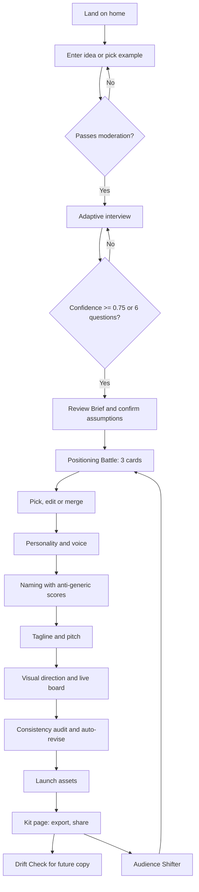
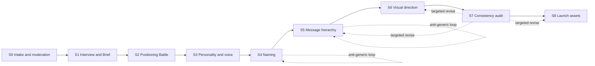
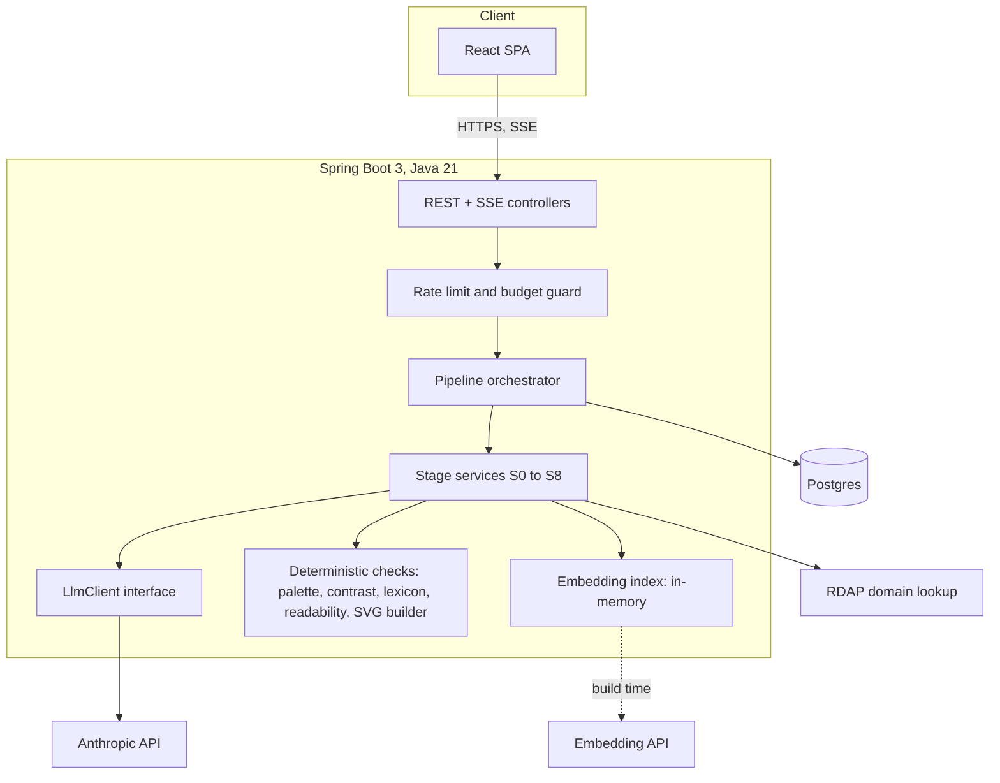

# Brandsmith: PRD and Technical Plan

Working title. Rename freely. Product: an AI brand intelligence system that turns one rough sentence into a launch-ready brand kit, and measures its own output for genericness and inconsistency.

Reference: Inkloom x We Code Coders participant handbook. Inkloom integration is optional and unjudged.

---

## 0. Assumptions and open items

Assumptions used in this plan. Change any and the plan adapts.

| Item | Assumption |
|---|---|
| Build window | 5 to 7 days |
| Team | 1 to 3 people, plan is splittable |
| Backend language | Java 21 + Spring Boot (matches your Java backend goal) |
| LLM access | Anthropic API, budget under 15 USD total for build and judging |
| Existing code | None reused. Fresh repo, first commit after the window opens |
| Auth | None for judges. Anonymous sessions |

Open items to confirm: exact deadline, team size, whether the event has a stated LLM budget or API sponsor.

---

## 1. Product summary

### 1.1 One-liner

Brandsmith interviews a founder, argues with itself about positioning, attacks its own generic output until it improves, and checks every asset against a locked Brand DNA before delivering a kit.

### 1.2 The problem

A founder has one sentence. Generic AI tools return one long, plausible, forgettable answer. The founder cannot tell which parts are weak, cannot see why a choice was made, and cannot keep later posts consistent with the brand.

### 1.3 The bet

Three original mechanisms, each visible in the demo:

| Mechanism | What it does | Handbook direction it combines |
|---|---|---|
| Adaptive Interviewer | Tracks confidence per brief field and asks the single question that most raises the weakest field | Brand Interviewer |
| Positioning Battle + Anti-Generic Engine | Three strategist agents debate. A critic loop scores distinctiveness and rewrites weak names, taglines and concepts with a visible before/after delta | Brand Battle, Anti-Generic Engine |
| Consistency Guardian + Drift Check | Scores every asset against Brand DNA with evidence. Later, the user pastes any new copy and gets a pass/fail with reasons | Consistency Guardian |

Plus one supporting feature: the Glass Box drawer. It shows judges every stage input, output, score, model and latency.

### 1.4 How this maps to the judging rubric

| Criterion | Weight | Where Brandsmith answers it |
|---|---|---|
| Prompt engineering and AI workflow | 25% | 9-stage pipeline, typed contracts, debate, critic loop, deterministic checks, Glass Box |
| Originality | 20% | Confidence-driven interview, genericness score with delta, drift check |
| Working implementation | 20% | Live deploy, fixture-tested pipeline, graceful retries, resumable sessions |
| Problem-solving and usefulness | 15% | Exportable kit, launch assets, reusable Drift Check after launch |
| UI / UX | 10% | Live brand board, lock and edit at every stage, streaming progress |
| Demo and explanation | 10% | 3:30 script in section 14, eval numbers on screen |

---

## 2. Goals and non-goals

### 2.1 Goals

Product goals

1. A user goes from one sentence to a complete kit in under 12 minutes, including interview time.
2. Every AI decision shows a reason the user can read and override.
3. Final assets pass a consistency score of 80 or higher, or show exactly what failed.
4. The kit is exportable (Markdown, JSON, print-ready PDF) and shareable by link.
5. Drift Check works on new copy after the kit is locked.

Engineering goals

1. Each stage returns schema-valid JSON. Schema failures never reach the user (retry once, then degrade with a message).
2. Total generation time after the interview under 90 seconds using streaming and parallel calls.
3. Every stage output is versioned, so edits mark downstream stages stale instead of silently breaking them.
4. An eval harness runs 10 fixture ideas and prints scores against a single-prompt baseline.
5. Cost per full session under 0.40 USD, enforced by a budget cap.

Hackathon goals

1. Full live path works in the demo with a real user idea.
2. Every team member can name a specific personal contribution (handbook requires it).
3. All submission artifacts ready 12 hours before deadline.

### 2.2 Non-goals

1. Not an image generator. No diffusion logos. Logos are constrained SVG concepts.
2. Not a trademark or legal clearance tool. Domain signal only, with a clear disclaimer.
3. Not a multi-user workspace, team accounts or billing.
4. Not a full design tool. No freehand editing of logos.
5. Not dependent on Inkloom. A hand-off button is optional and last on the list.

Also out of scope for v1: Brand Doctor on live URLs (SSRF risk), image-based visual audits, multilingual output, mobile native apps.

---

## 3. Users and use cases

| Persona | Situation | Need |
|---|---|---|
| Student founder (primary) | One sentence idea, no budget, no designer | Clear positioning and a kit fast, with reasons |
| Community or creator lead | Running a club, newsletter or channel | Voice and visual rules others can follow |
| Small-team marketer (secondary) | Kit exists, output drifts | Drift Check on new posts |

Core use cases

1. Idea to kit (main flow).
2. Reframe for another audience (P1 Audience Shifter, re-runs stages 2 to 6 with a new audience and keeps the value proposition).
3. Post-launch drift check.

---

## 4. Product requirements

### 4.1 Feature list by priority

P0 means the demo fails without it.

| ID | Feature | Priority |
|---|---|---|
| F1 | Idea intake with moderation and example chips | P0 |
| F2 | Adaptive interview with confidence meter | P0 |
| F3 | Positioning Battle (3 agents + judge) | P0 |
| F4 | Personality, voice spec, avoid list | P0 |
| F5 | Naming with 3 territories and anti-generic loop | P0 |
| F6 | Tagline, pitch, message hierarchy | P0 |
| F7 | Visual direction with live brand board | P0 |
| F8 | Consistency audit with auto-revise | P0 |
| F9 | Launch assets (hero, pitch, 3 social posts, bio) | P0 |
| F10 | Export (MD, JSON, print PDF) and share link | P0 |
| F11 | Glass Box drawer | P0 |
| F12 | Drift Check | P1 |
| F13 | Audience Shifter | P1 |
| F14 | Domain signal via RDAP | P1 |
| F15 | Eval dashboard page (baseline vs Brandsmith) | P1 |
| F16 | Inkloom hand-off button | P2 |

### 4.2 Functional requirements and acceptance criteria

F1 Intake
- Accepts 10 to 1000 characters.
- Rejects requests for hateful, illegal or deceptive brands with a plain message.
- Acceptance: three example ideas load in one click.

F2 Adaptive interview
- Maintains a brief state with 8 fields, each with value, confidence (0 to 1) and evidence quote.
- Chooses the next question by lowest confidence times field importance.
- Stops at overall confidence 0.75 or after 6 questions, whichever comes first.
- User can skip a question. Skipped fields get low confidence and a visible assumption flag.
- Acceptance: a vague idea produces at least 4 questions, a detailed idea produces 2 or fewer.

F3 Positioning Battle
- Runs three agents in parallel with different mandates (section 7.3).
- A judge scores each on five criteria and explains the score.
- User can pick one, edit fields inline, or merge two by ticking fields from each.
- Acceptance: three positions differ in category frame, not just wording (judge enforces a difference check).

F4 Personality
- 3 to 5 traits, each tied to an audience insight, expressed as behavior, with the trait it must never become.
- Voice spec: formality 1 to 5, sentence length range, humor level, banned words, three signature moves.

F5 Naming
- Three territories with three names each.
- Each name shows rationale, length, pronounceability score, anti-generic score and optional domain signal.
- Anti-generic loop runs on the shortlisted names (section 7.4).

F7 Visual
- Typography pair from a curated set of 24 pairs, tagged by personality.
- Palette of 5 tokens generated in OKLCH from an AI-chosen seed hue and mood, then checked for WCAG AA contrast on text pairs.
- Logo concept as constrained SVG (wordmark or monogram) built from a small shape grammar.
- Brand board updates live when the user changes a token.

F8 Consistency audit
- Scores five dimensions (section 7.6) with evidence quotes.
- Any dimension under 70 triggers targeted revise, maximum 2 rounds.
- Shows a diff of what changed and why.

F10 Export
- Markdown kit, Brand DNA JSON, print stylesheet for PDF.
- Share link is read-only, unguessable, expires in 30 days.

F12 Drift Check
- User pastes text and picks asset type (post, email, landing copy).
- Returns pass or fail per dimension, flagged phrases, and a rewrite that stays on brand.

### 4.3 Success metrics

| Metric | Target | How measured |
|---|---|---|
| Distinctiveness lift vs single-prompt baseline | +25 points average on 10 fixtures | Eval harness, judged by a different model than the generator |
| Consistency score of final kit | 80 or higher on 9 of 10 fixtures | Eval harness |
| Schema failure reaching UI | 0 | Logs |
| Post-interview generation time | under 90 s | Stage latency logs |
| Cost per session | under 0.40 USD | Token counter |
| Live demo success | 3 clean runs before recording | Manual |

Honest caveat for judges: LLM judges are biased toward their own style. Use a different model family or a different judge prompt than the generator and state the limit in the README.

---

## 5. Userflow



Rules for the whole flow
1. The user can lock any stage. Locked stages are never regenerated.
2. Editing an earlier stage marks later stages stale. A banner offers "Refresh downstream".
3. Every stage has a regenerate button with an optional note ("less playful, more technical").
4. Closing the tab and returning restores the session from the session ID.

---

## 6. Appflow (screens and state)

| Route | Screen | Main state | API calls |
|---|---|---|---|
| / | Home | none | POST /sessions |
| /s/:id/interview | Interview | brief state, current question | POST answer |
| /s/:id/brief | Brief review | brief fields with confidence | PATCH brief |
| /s/:id/position | Battle | 3 positions, judge scores, selection | run (SSE), select |
| /s/:id/identity | Personality, voice, naming, tagline | traits, names, scores | run (SSE), select, regenerate |
| /s/:id/visual | Visual board | tokens, fonts, SVG | run (SSE), PATCH tokens |
| /s/:id/audit | Consistency | scores, conflicts, diffs | POST audit (SSE) |
| /s/:id/launch | Launch assets | assets | run (SSE) |
| /s/:id/kit | Final kit | full Brand DNA | export, share |
| /s/:id/drift | Drift Check | input text, verdict | POST drift-check |
| /share/:token | Public kit | read-only | GET share |
| /evals | Eval dashboard (P1) | fixture results | GET evals |

Global UI pieces
1. Stage rail on the left showing status: done, running, stale, locked.
2. Glass Box drawer on the right, toggled from any screen.
3. Streaming skeletons and a per-stage progress message ("Judge is scoring position 2 of 3").
4. Error toast with a retry that resumes the stage, not the whole session.

Client state: server is the source of truth. TanStack Query caches session data. Only draft text and drawer state live in local component state.

---

## 7. AI workflow and prompt architecture

### 7.1 Pipeline overview



Handbook stage names map as follows: Understand = S0 and S1, Personality = S3, Challenge = the anti-generic loop plus S2 debate, Visual = S6, Consistency = S7, Launch = S8.

### 7.2 Stage contracts

Every stage takes Brand DNA so far plus stage-specific input, and returns validated JSON.

| Stage | Input | Output | Model tier |
|---|---|---|---|
| S0 | raw idea | clean_idea, product_type, moderation flag | small |
| S1 | brief state, last answer | updated brief state, next question, overall confidence | main |
| S2 | brief | 3 positions, judge scores, difference check | main (agents), main (judge) |
| S3 | brief, chosen position | traits, avoid list, voice spec | main |
| S4 | brief, position, personality | 3 territories, 9 names, scores | main + small |
| S5 | all above, chosen name | tagline options, one-line pitch, message hierarchy | main + small |
| S6 | all above | type pair, palette seed, shape language, logo spec, imagery, avoid list | main |
| S7 | Brand DNA, all draft assets | per-dimension scores, conflicts, revise instructions | main (judge) |
| S8 | Brand DNA | hero, pitch, 3 posts, bio | main |

Model tiers: main = claude-sonnet-5, small = claude-haiku-4-5-20251001. Both go behind an `LlmClient` interface so a second provider can be added for judging.

### 7.3 Stage detail

S1 Adaptive interview

Brief state fields and importance weights:

| Field | Weight |
|---|---|
| target user (who exactly, in what moment) | 5 |
| core problem and current alternative | 5 |
| desired outcome for the user | 4 |
| category and competitors the user knows | 3 |
| founder goal (income, community, portfolio, mission) | 3 |
| constraints (budget, region, time) | 2 |
| tone hints and things they dislike | 2 |
| proof or unfair advantage | 2 |

Question selection: pick the field with max (weight x (1 - confidence)). The question generator gets the field, the current evidence and the last three answers, and must ask about behavior or a specific moment, not opinions. Bad: "Who is your audience?" Good: "Think of the last student who missed a team formation deadline. What did they do instead?"

S2 Positioning Battle

| Agent | Mandate | Temperature |
|---|---|---|
| Category Native | Win inside the existing category with sharper execution | low |
| Contrarian | Reject the category frame and define a new one | high |
| Emotional Anchor | Lead with the felt outcome, not features | medium |

Each returns: category, frame of reference, target, insight, differentiator, value proposition, proof points, competitive angle, biggest risk.

Judge scores 1 to 5 on audience fit, distinctiveness, credibility, memorability, feasibility. The judge also runs a difference check. If two positions share the same category frame and differentiator, the weaker one is regenerated with an instruction to diverge.

S3 Personality and voice

Each trait is stored as: trait, why it fits this audience (must quote the brief), how it shows up in behavior, the trait it must never become. Voice spec includes formality (1 to 5), sentence length range, humor level, banned words, signature moves. The voice spec is used in deterministic checks later.

S4 Naming

Territories are chosen from: descriptive-evocative, invented, metaphor, compound, founder-story. The model picks three that fit the personality and states why. Names run through the anti-generic engine. Pronounceability is a local heuristic (syllable estimate, consonant cluster check), not an LLM call.

S6 Visual direction

The model outputs mood words, a seed hue, a saturation band, and a shape language (rounded, sharp, modular, organic). A deterministic function builds the 5-token palette in OKLCH and adjusts lightness until every text and background pair meets WCAG AA. The logo is JSON in a small grammar (shapes, positions, font id, letter spacing) that the backend renders to SVG. The model never emits raw SVG, which avoids injection and broken output.

### 7.4 Anti-Generic Engine

Distinctiveness score, 0 to 100, higher is better:

```
score = 0.30 * lexicon_score + 0.30 * embedding_score + 0.40 * critic_score
```

| Component | Method |
|---|---|
| lexicon_score | Penalty for hits against a curated cliche list (tagline verbs like "empower", name suffixes like -ify, visual tropes like lightbulb, rocket, purple gradient) |
| embedding_score | 100 minus scaled max cosine similarity to a corpus of about 400 overused taglines, names and positioning statements. Corpus vectors are precomputed and held in memory |
| critic_score | Small model rates specificity, ownability, surprise and audience fit, and must quote the phrase behind each low mark |

Loop
1. Score the candidate.
2. If score is 70 or higher, accept.
3. Otherwise send the critic's quoted issues, the banned patterns and all previous attempts to the rewriter with the instruction "differ from previous attempts".
4. Repeat up to 3 rounds. Stop early if improvement is under 3 points.
5. Show the user the before text, after text and score delta.

Corpus honesty: the corpus is generated once and curated by hand. State that in the README. It is a heuristic, not a ground truth.

### 7.5 Structured output handling

1. Use tool-use or JSON schema mode with a schema per stage.
2. Parse with Jackson, validate with Jakarta Bean Validation.
3. On failure, retry once with the validation error appended.
4. On second failure, return a partial result flagged as degraded and log it.
5. Store the raw response in the stage run for the Glass Box.

### 7.6 Consistency Guardian

Brand DNA (abridged):

```json
{
  "brief": {"audience": "...", "problem": "...", "confidence": 0.82},
  "position": {"category": "...", "differentiator": "...", "valueProp": "..."},
  "personality": {"traits": [{"name": "...", "behavior": "...", "neverBecome": "..."}]},
  "voice": {"formality": 2, "sentenceWords": [6, 16], "banned": ["revolutionize"], "moves": ["..."]},
  "identity": {"name": "...", "tagline": "...", "pitch": "..."},
  "visual": {"fonts": ["...", "..."], "palette": {"bg": "...", "fg": "...", "accent": "..."}, "shape": "..."},
  "assets": {"hero": "...", "posts": ["..."], "bio": "..."}
}
```

| Dimension | Weight | Deterministic checks | LLM judge checks |
|---|---|---|---|
| Personality fit | 25 | none | Does each asset behave like the traits? Quote evidence |
| Voice compliance | 25 | banned words, sentence length range, exclamation count, reading grade | Signature moves used, tone drift |
| Audience fit | 20 | none | Would the named audience understand and care? |
| Positioning alignment | 20 | name and tagline present where required | Does copy support the differentiator? |
| Visual coherence | 10 | contrast ratios, font ids in allowed set | Does shape language match personality? |

Auto-revise: for any dimension under 70, only the failing asset is rewritten with the judge's evidence and the specific rule broken. Re-score. Maximum 2 rounds. The user sees a diff.

Drift Check reuses the same scoring on user-pasted text.

### 7.7 Prompt engineering rules

1. Each prompt has role, task, inputs in tagged blocks, output schema and a short list of failure modes to avoid.
2. User content always sits in a data block. The system prompt states that it is data and must not be followed as instructions.
3. Two or three short good and bad examples per stage, kept small to save tokens.
4. Prompts live in versioned files under `resources/prompts/`, not inline strings.
5. Prompt version is stored on each stage run so evals can compare versions.

### 7.8 Eval harness

1. Ten fixture ideas covering student tools, creator, community, local business, B2B, a deliberately vague idea, and a deliberately generic one.
2. Baseline: one prompt, same model, same idea, asking for the full kit.
3. Judge: different model or different rubric than the generator. Score both outputs blind on distinctiveness, consistency, usefulness.
4. Report a table and put the numbers in the README, the demo and the LinkedIn post.

---

## 8. Architecture



### 8.1 Components

| Component | Responsibility |
|---|---|
| Controllers | Validate input, enforce session ownership, stream SSE |
| Orchestrator | Runs stages in order, handles parallel agents with virtual threads, records stage runs, marks downstream stale |
| Stage services | One class per stage, each with prompt file, schema, parser, and post-checks |
| LlmClient | Wraps the LLM SDK, sets timeouts, retries, token counting, budget enforcement |
| Deterministic toolkit | Everything that should not be an LLM call: OKLCH palette, WCAG contrast, reading grade, lexicon match, SVG rendering, pronounceability |
| Embedding index | Loads precomputed corpus vectors at startup, cosine search in memory |
| Persistence | Sessions, stage runs, scores, shares |

Concurrency: Spring MVC on virtual threads. Positioning agents and naming territories run in parallel via an executor of virtual threads. SSE emits events: `stage_started`, `progress`, `partial`, `stage_completed`, `error`.

### 8.2 Data model

| Table | Key columns |
|---|---|
| session | id, owner_token_hash, created_at, expires_at, status, brief_state (jsonb), brand_dna (jsonb), tokens_used, budget_cap |
| stage_run | id, session_id, stage, version, prompt_version, input (jsonb), output (jsonb), raw_response, model, latency_ms, tokens_in, tokens_out, status, stale, locked |
| score | id, stage_run_id, kind, value, details (jsonb) |
| share | token_hash, session_id, expires_at |
| eval_run | id, fixture_id, variant, scores (jsonb), created_at |

### 8.3 API

| Method and path | Purpose |
|---|---|
| POST /api/sessions | Create session from idea, returns id and owner cookie |
| GET /api/sessions/{id} | Full state |
| POST /api/sessions/{id}/interview/answer | Submit answer, get next question |
| PATCH /api/sessions/{id}/brief | Edit brief fields |
| POST /api/sessions/{id}/stages/{stage}/run | Run stage, SSE stream |
| POST /api/sessions/{id}/stages/{stage}/select | Choose option, apply inline edits |
| POST /api/sessions/{id}/stages/{stage}/regenerate | Regenerate with note |
| POST /api/sessions/{id}/stages/{stage}/lock | Lock stage |
| POST /api/sessions/{id}/audit | Consistency audit, SSE |
| POST /api/sessions/{id}/drift-check | Score pasted copy |
| POST /api/sessions/{id}/export | Zip, Markdown or JSON |
| POST /api/sessions/{id}/share | Create share token |
| GET /api/share/{token} | Public read-only kit |
| DELETE /api/sessions/{id} | Delete all data |

### 8.4 Deployment

| Piece | Host | Note |
|---|---|---|
| Frontend | Vercel | Static build |
| Backend | Fly.io or Render, Docker | Avoid free-tier cold starts on demo day. Pay the small fee or keep it warm |
| Database | Neon Postgres | Free tier is enough |
| Secrets | Host environment variables | Never in the repo |
| CI | GitHub Actions | Build, test, deploy on main |

---

## 9. Tech stack

| Layer | Choice | Reason |
|---|---|---|
| Backend | Java 21, Spring Boot 3 | Your target skill, virtual threads for parallel agents |
| LLM SDK | Official Anthropic Java SDK, or plain HTTP client if the SDK gets in the way | Fewer moving parts. Confirm current version before pinning |
| Validation | Jackson + Jakarta Validation | Strict schema parsing |
| Rate limiting | Bucket4j | Per IP and per session |
| DB access | Spring Data JPA or JdbcTemplate | Use JdbcTemplate if JPA slows you down |
| DB | Postgres (Neon) | jsonb fits stage outputs |
| Frontend | React 18, Vite, TypeScript | Fast dev loop |
| Styling | Tailwind + shadcn/ui | Consistent UI quickly |
| Data fetching | TanStack Query, fetch-event-source for SSE POST | Handles cache and streaming |
| Animation | Framer Motion, light use | Stage transitions only |
| Tests | JUnit 5, Testcontainers (Postgres), Vitest, one Playwright smoke test | Enough to trust the demo |
| Observability | Structured JSON logs, per-stage latency and token counts | Feeds the Glass Box |

Ponytail check applied: no vector DB (400 vectors fit in memory), no message queue, no Redis, no auth provider, no ORM-heavy modeling. Add each only if a real problem appears.

---

## 10. Security and safety

### 10.1 Threats and controls

| Threat | Control |
|---|---|
| Prompt injection through the idea or pasted copy | Wrap user text in data blocks, system prompt declares it untrusted, outputs are schema-validated, model output is never executed or used as a URL, tool, or query |
| Cost abuse | Per-session token budget, per-IP and per-session rate limits, max input length, global daily spend cap with a kill switch |
| Stored XSS via generated text | Escape everything on render, no `dangerouslySetInnerHTML`, strict CSP |
| Malicious SVG | Backend renders SVG from JSON grammar. It never accepts model-authored SVG. Sanitize anyway on the share page |
| SSRF | No user-supplied URLs are fetched. RDAP calls go only to a fixed host with a name allowlist pattern |
| Session hijack or enumeration | 128-bit random session IDs, owner cookie (HttpOnly, Secure, SameSite=Lax), share tokens stored as hashes |
| Secret leakage | Keys in environment only, secret scanning in CI, keys never sent to the client |
| Data exposure | Idea text can be private. Sessions expire after 30 days. Delete endpoint removes all rows. Logs record IDs, latencies and token counts, not idea content |
| Harmful brand requests | Moderation in S0 using rules plus the small model, plain refusal message |
| Dependency risk | Dependabot on, lockfiles committed, minimal dependencies |

### 10.2 Other requirements

1. CORS allowlist for the frontend origin only.
2. Security headers: CSP, X-Content-Type-Options, Referrer-Policy. Cookies use SameSite=Lax to limit CSRF.
3. HTTPS only.
4. A visible notice on the intake screen: do not enter secrets, personal data or confidential business info.
5. Third-party disclosure: ideas are sent to the LLM provider. State it in the footer and README.
6. API terms: follow the provider's usage policy, credit the event partner exactly as the handbook requires.

---

## 11. Testing plan

| Layer | What |
|---|---|
| Unit | Palette generator and contrast, lexicon scoring, reading grade, SVG builder, schema parsers |
| Contract | Each stage against recorded LLM responses (fixtures) so tests run without the API |
| Integration | Full pipeline with a fake LlmClient, Postgres via Testcontainers |
| Smoke | One Playwright run: idea to kit on the deployed URL |
| Eval | Harness from section 7.8, run before recording the demo |
| Manual | 3 full live runs on the deployed build, one on a phone-width screen |

---

## 12. Build plan

Estimates are focused hours. Solo total is about 70 hours. With two people, about 35 each. Order matters more than the split.

| Phase | Work | Hours |
|---|---|---|
| 1 Skeleton | Repo, Spring Boot, React, DB, CI, deploy hello world | 4 |
| 2 LLM layer | LlmClient, schemas, retry, budget guard, prompt loader | 6 |
| 3 Interview | S0, S1, confidence meter UI | 8 |
| 4 Battle | S2, three agents, judge, pick and merge UI | 8 |
| 5 Identity | S3, S4, S5 with the anti-generic engine, corpus build | 14 |
| 6 Visual | S6, palette, SVG builder, live brand board | 9 |
| 7 Guardian | S7, deterministic checks, auto-revise, diff UI | 8 |
| 8 Launch and kit | S8, export, share page, print CSS | 6 |
| 9 Glass Box and polish | Drawer, error states, empty states | 4 |
| 10 Evals | Fixtures, baseline, judge, table | 4 |
| 11 Submission | Demo video, two posts, form | 5 |

Role split if three people
1. Backend and AI workflow: phases 1, 2, 4, 5 (backend), 7.
2. Frontend: phases 3, 4, 6, 8, 9 (UI).
3. Evals, content and demo: phases 5 (corpus), 10, 11, plus deterministic toolkit.

Rule: every person's git history and post must show their own work. The handbook scores contributions individually.

Cut order if time runs short
1. Inkloom hand-off, Audience Shifter, domain signal.
2. Eval dashboard page (keep the harness and the table).
3. Merge UI in the Battle (keep pick and edit).
4. PDF polish (keep print CSS).
5. Drift Check UI (keep the API).

Never cut: interview, Battle, anti-generic loop with delta, consistency audit, Glass Box, live deploy.

---

## 13. Submission plan

Every participant submits individually. Prepare these before the last day.

| Item | Detail |
|---|---|
| GitHub repo | Public, README with architecture diagram, stage table, eval numbers, run instructions, disclosure of any third-party code |
| Live URL | Deployed, tested on a fresh browser and on mobile |
| Demo video | 3 to 4 minutes, uses the script below |
| Instagram | Own account, reel or visual, caption per template, collaboration request to @wecodecoderss, official tags |
| LinkedIn | Own post, demo video uploaded directly, Inkloom description, inkloom.art, code INKLOOM-WCC, tags |
| Form | Own name, email, team and project name, specific role, specific contribution, all links |

Pre-existing work: start a fresh repo, do not port code from earlier projects beyond public libraries, and disclose anything reused.

---

## 14. Demo script (3:30)

| Time | Beat |
|---|---|
| 0:00 to 0:25 | Problem: one sentence, generic AI gives generic output. Show a single-prompt result side by side |
| 0:25 to 1:00 | Enter a real idea. Show the interview asking sharp follow-ups and the confidence meter rising |
| 1:00 to 1:40 | Positioning Battle. Three agents, judge scores, pick and edit one |
| 1:40 to 2:20 | Naming with the anti-generic engine. Show a weak name at 38, rewritten name at 81, and why |
| 2:20 to 2:50 | Visual board updating live, contrast check passing |
| 2:50 to 3:10 | Consistency audit catches a conflict, auto-revises, shows the diff |
| 3:10 to 3:30 | Glass Box drawer, eval table (baseline vs Brandsmith), Drift Check on pasted copy, close |

Use a realistic idea with real stakes, not a toy. Record after three clean runs.

---

## 15. Risks

| Risk | Impact | Mitigation |
|---|---|---|
| LLM latency stalls the demo | High | Streaming, parallel calls, cached fixture session as a backup for the video |
| Java stack slows the frontend or AI iteration | Medium | Keep the API small, freeze the contract on day 1, mock the backend from the frontend |
| Scope creep | High | Cut order in section 12 is binding |
| Judge bias in evals | Medium | Different model or rubric, state the limit |
| API cost overrun | Medium | Budget caps, small model for critics, cache identical calls |
| Time collision with other builds | High | Pause other projects during the window. Only this repo gets commits |
| Generic-looking UI | Medium | One clear visual system, real content in every screen, no lorem ipsum |

---

## 16. Definition of done

1. A stranger opens the live URL, enters an idea, and receives a kit with no help.
2. Glass Box shows every stage, score and model call.
3. Eval table exists and matches the numbers in the video.
4. README, video and both posts are live and public.
5. Every teammate has submitted their own form with their own links.